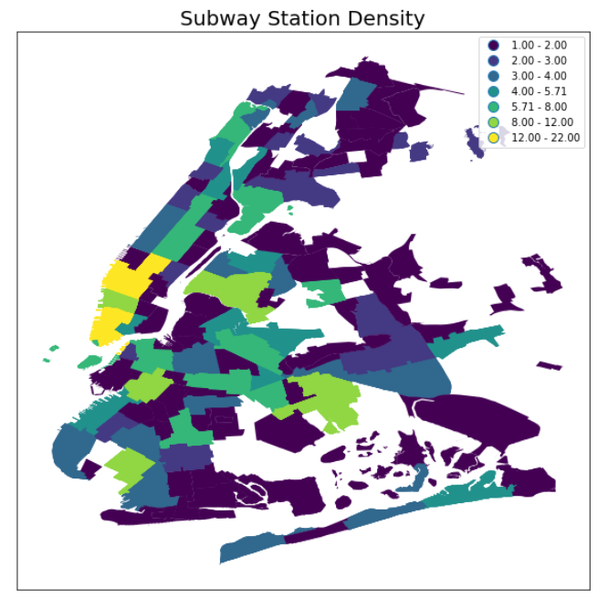

# HW11_ml6506
* I completed this week homework individually. I used 72 hours extension for this week HW.

## Assignment1 Time series
* Link: https://github.com/mengyunli0220/PUI2018_ml6506/blob/master/HW11_ml6506/HW11_Assignment1%20final.ipynb
## Assignment2 Improve visulization 
* The sugguestions from peers are that the map is not significant enough and a little bit dark. In this case, I changed the scheme from"Equal_interval"  into " Quantiles" , which could better show the difference between areas.
* Link: https://github.com/mengyunli0220/PUI2018_ml6506/blob/master/HW11_ml6506/HW11_Visualization_Revised.ipynb

