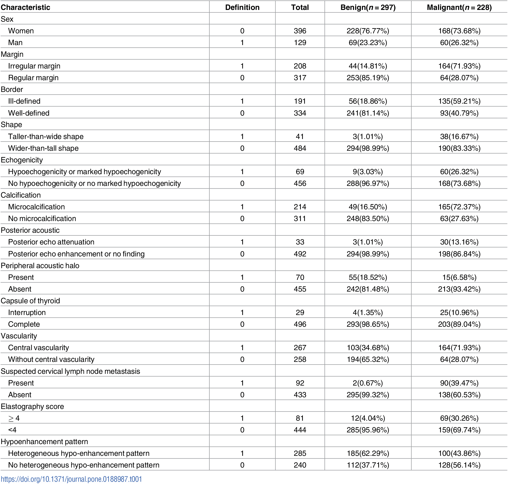

## 1. t-test
## 1.1 t-test Table

| **Statistical Analyses**	|  **IV(s)**  |  **IV type(s)** |  **DV(s)**  |  **DV type(s)**  | **Question to be answered** | **_H0_** | **alpha** | **link to paper**| 
|:----------:|:----------|:------------|:-------------|:-------------|:------------------|:----:|:-------:|:-------|
t-test	| 1, neighboring grade | dichotomous | 1,  vehicular speeds| continuous | Does the speed at a smaller grade equals that at a neighboring larger grade? |Speed at a smaller grade = Speed at a neighboring larger grade | 0.05 | [Evaluating the impacts of grades on vehicular speeds on interstate highways](https://journals.plos.org/plosone/article?id=10.1371/journal.pone.0184142) |
  |||||||||
  
## 1.2 The main plot of the paper (t-test)
 
 

## 2. Correlation
## 2.1 Correlation Table
| **Statistical Analyses**	|  **IV(s)**  |  **IV type(s)** |  **DV(s)**  |  **DV type(s)**  | **Question to be answered** | **_H0_** | **alpha** | **link to paper**| 
|:----------:|:----------|:------------|:-------------|:-------------|:------------------|:----:|:-------:|:-------|
Correlation	| 1, Mimicry | continuous | 1,  Automatic Imitation| continuous | whether mimicry and automatic imitation are actually correlated |Mimicry is correlated with automatic imitation| 0.05 | [Mimicry and automatic imitation are not
correlated](https://journals.plos.org/plosone/article?id=10.1371/journal.pone.0183784) |
  |||||||||

## 2.2 The main plot of the paper (Correlation)

Table 1. Intercorrelations between the mimicry score and all different automatic imitation scores.

## 3 Logistic Regression
## 3.1 Logistic Table

| **Statistical Analyses**	|  **IV(s)**  |  **IV type(s)** |  **DV(s)**  |  **DV type(s)**  | **Question to be answered** | **_H0_** | **alpha** | **link to paper**| 
|:----------:|:----------|:------------|:-------------|:-------------|:------------------|:----:|:-------:|:-------|
Logistic Regression	| 14, Age, Sex, Margin, Border, Shape, Echogenicity, Calcification, Posterrior acoustic, Peripheral acoustic, peripheral acoustic halo, Capsule of thyroid, Vascularity, Suspected cervical lymph node metastasis, Elastography score, Hypoenhancement patern.  |categorical| 1,  occurrence of maligant thyroid nodule| dichotomous | probability of suffering from maligant thyroid nodule|  | 0.05 | [Logistic regression analysis of conventional ultrasonography, strain elastosonography, and contrast-enhanced ultrasound characteristics for the differentiation of benign and malignant thyroid nodules](https://journals.plos.org/plosone/article?id=10.1371/journal.pone.0188987) |
  |||||||||
  
## 3.2 The main plot of the paper (Logistic)

Table 2. Clinical data for the patients and nodules.

Table 3. The result of logistic regression analysis.
